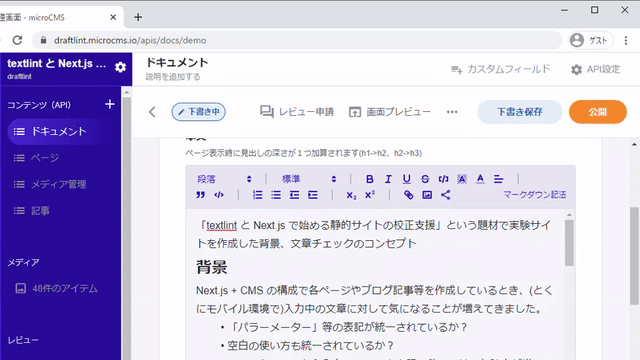

# draftlint

「textlint と Next.js で始める静的サイトの校正支援」という題材で作成した実験サイト「draftlint」のソースリポジトリーです。


## 概要

リポジトリのソースを稼働させ、microCMS サービスと連携させると「CMS のエディターで入力した文章を Next.js のプレビューモードでチェックできる」サイトになります。



詳細は [draftlint | textlint in Next.js preview mode](https://draftlint.vercel.app/) を参照してください。「microCMS + CodesadBox」の構成で試す手順等が記載されています。


## デプロイ用の情報

設定に必要な情報は以下のとおりです。具体的な設定方法についてはネットで検索してください(有名所のサービスを利用しているので情報はすぐに出てくるはずです)。

### microCMS のサービス

- サービス名: 任意
- API: `pages` と `docs` を作成(スキーマはこのリポジトリーの `misc/api_*.json` を使用)
- コンテンツ: `pages` API にコンテンツ ID が `home` `docs` `about` 、`docs` API に任意のコンテンツが最低でも 1 つ必要です
- 画面プレビュー: 各 API に以下の値を設定

```
https://<デプロイ先 URL>/api/enter-preview/<API 名 'page' or 'docs'>?slug={CONTENT_ID}&draftKey={DRAFT_KEY}&previewSecret=<任意の値>
```


### CodeSandbox / Vercel の設定

上記のサイトでは環境変数(secret)を設定することで CMS として microCMS をできるようになります。


| 変数名                | 用途           | 設定内容
| --------------------- | -------------- | ----------------------------------------------------------- |
| API\_BASE\_URL        | GET API URL    | `https://<service>.microcms.io/` (末尾の `/` は必須) |
| GET\_API\_KEY         | GET API KEY    | `********-****-****-****-************`                |
| PREVIEW\_SECRET       | プレビュー PSK | 任意の値、画面プレビューに記述する値と合わせる     |
| DISABLE\_MOCK\_CLIENT | モック無効化   | CodeSandbox で利用するときに "true" を設定します      |

必須ではありませんが `GLOBAL_DRAFT_KEY` の設定もできます。

## ライセンス

MIT License

Copyright (c) 2021 hankei6km

